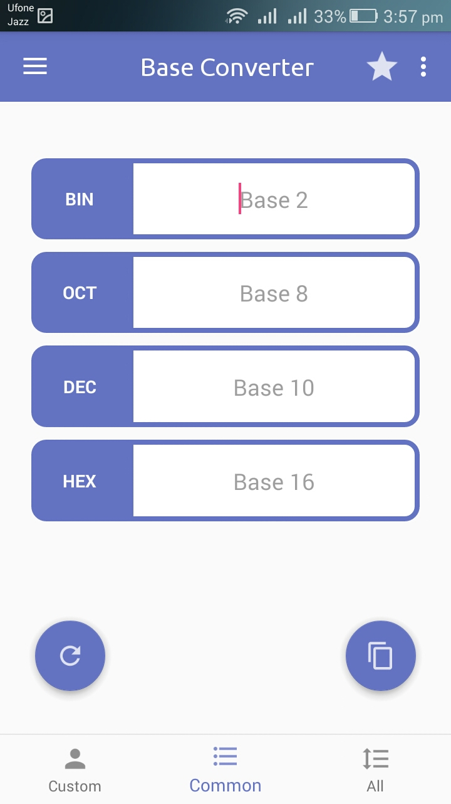
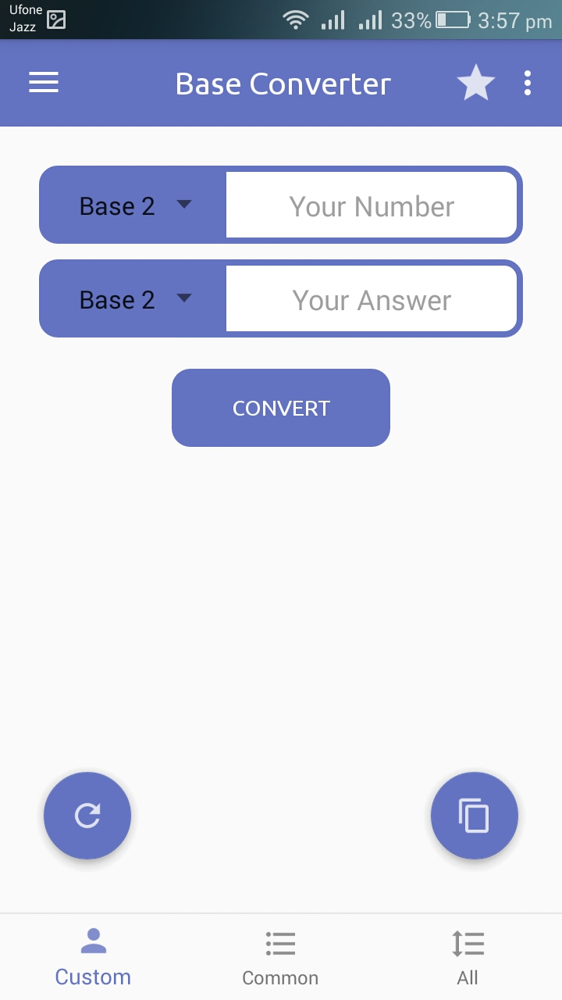
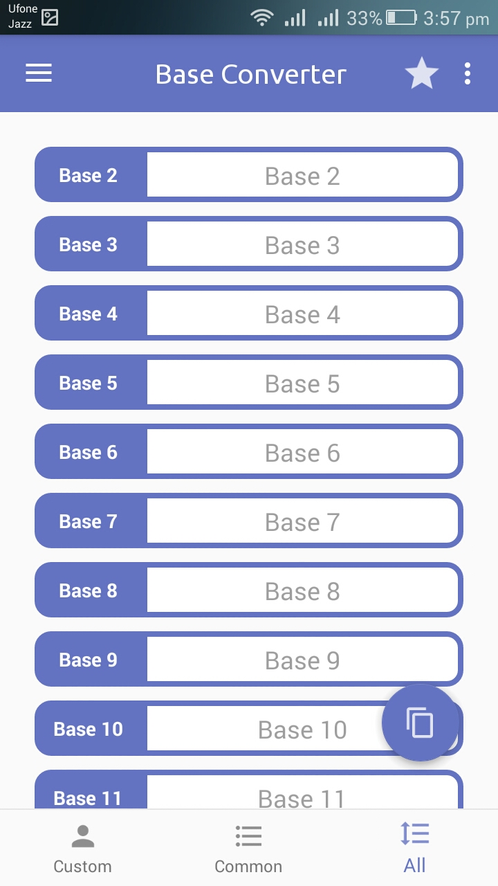

# base_converter

### The application, Base Converter, will provide:
*	Conversion b/w All The Bases Upto Base: 16. 
*	Work On All Android Devices With API: 19 (4.4 Kitkat) Or Above.
*	Three Different Display Modes.
*	Run-Time Calculation Control.

### How To Use:

*	Open Our Android Application.
*	Enter Your Input In Related Field.
*	Pickup Your Answer From Desired Field.
*	Change the Display as You Want. (i.e. All Bases, Common Bases OR Default Mode).
*	Press ‘Reset’ For New Input.
*	That’s it! You Are Done.

### Screenshots:

